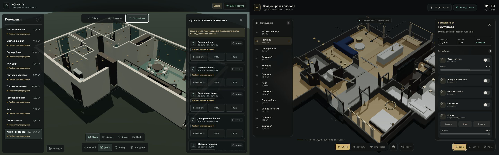
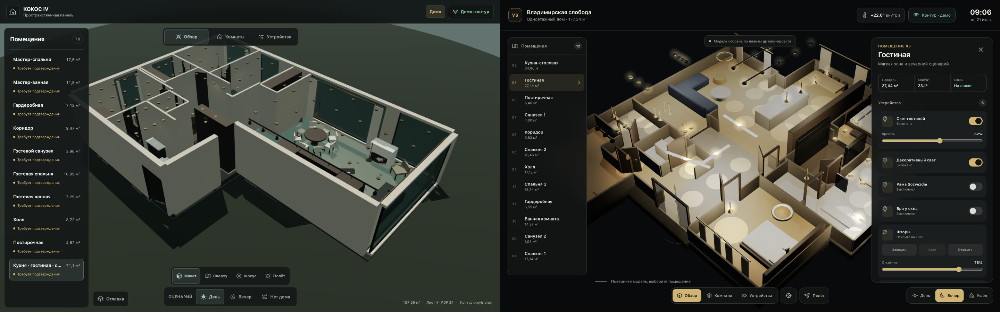
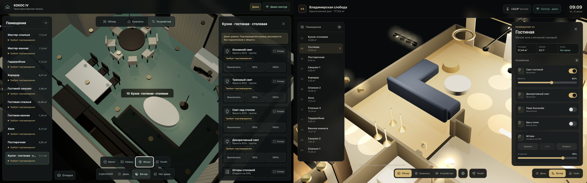
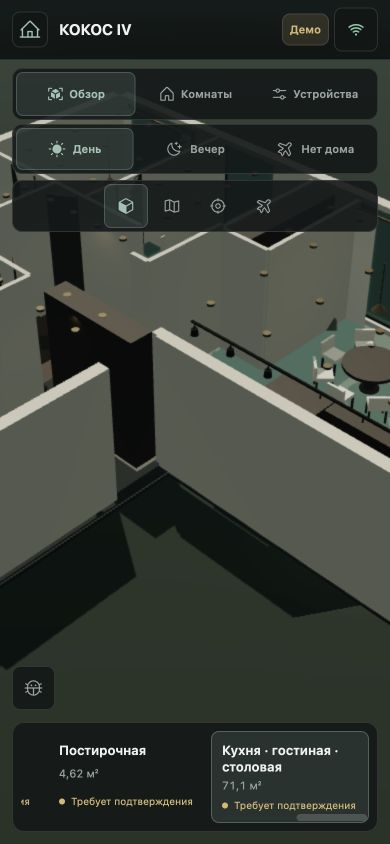

# Сравнительный визуальный аудит: КОКОС IV и «Владимирская слобода»

Дата: 21 июля 2026 года.

## Scope

- КОКОС IV: production preview `http://127.0.0.1:4173/`.
- Референс: `https://ambboy.github.io/vladimirskaya-sloboda-3d/`.
- Основное сравнение выполнено при одинаковом viewport 1440×900.
- Проверены обзор, дневной/вечерний сценарии, панель устройств и фокус камеры.
- Мобильный кадр КОКОС проверен при 390×844; корректный парный мобильный кадр референса получить не удалось, поэтому сравнительные выводы для mobile не заявляются.

## Статус после P0-переработки

Проблемы P0 из этого аудита устранены в production-сборке 21.07.2026: нейтральный фон без круглого подиума, authored dollhouse/room cameras, safe framing, presentation-cutaway, selection overlay без перекраски пола, studio environment, центрированный sun, настоящая rounded geometry, fixture LOD и переработанный вечерний свет. Новый манифест света содержит **59 символов** из подтверждённого JPG и 13 управляемых rigs; для производительности используются 22 кластерных реальных источника, а отдельное дешёвое пятно связано с каждым символом.

Повторная browser QA production-сборки: консоль чистая, общий и верхний вечерние ракурсы читаемы, команда «Линейная подсветка» проходит `pending → confirmed → off`. Оставшийся разрыв с референсом — P1: точные текстуры и каталожные 3D-модели мебели.

Снимки ниже сохраняются как **baseline до переработки** и объясняют происхождение решений; они не являются текущим состоянием production build.

## Исходный вердикт baseline

КОКОС IV функционально собран, но визуально находится на уровне проверочного BIM/proxy-макета. Референс выглядит как презентационный продукт. Разрыв создаёт прежде всего 3D-сцена — камера, cutaway, свет, материалы и выразительность мебели; UI является вторичной проблемой.

Ранее присвоенный проекту статус «готово» был преждевременным: автоматическая геометрическая QA подтверждала корректность контракта, но не доказала визуальный паритет с референсом.

## Evidence

### 1. Дневной overview и devices — КОКОС: слабое; reference: сильное

- Полноразмерные стены КОКОС закрывают помещения и мебель.
- Модель не учитывает safe-area между rail и inspector.
- Светильники читаются как множество одинаковых потолочных монет.
- Референс сохраняет видимость всех основных комнат и предметов между панелями.

### 2. Общий dollhouse — КОКОС: слабое; reference: сильное

- Серо-зелёный фон и круглая подложка КОКОС образуют диагональный визуальный разлом.
- Большинство поверхностей различаются только плоским цветом.
- Референс отделяет архитектуру тёмным фоном, даёт ясную глубину и заполняет помещения узнаваемыми силуэтами.

### 3. Фокус помещения — КОКОС: критически слабое; reference: сильное

- Фокус КОКОС становится почти вертикальным техническим планом.
- Mint-emissive выбранного пола подменяет реальный материал комнаты.
- Центральная подпись и inspector закрывают рабочую композицию.
- В референсе диагональная камера показывает предметы, свет и глубину помещения.

### 4. Mobile КОКОС — требует переработки

- Три панели управления занимают верхние 230 px экрана.
- Камера не перекадрирует модель под оставшуюся safe-area.
- Нижняя карусель и крупные стены конкурируют с 3D-сценой.
- Горизонтального overflow нет, но основной объект интерфейса визуально подавлен.

## Что работает

- Планировка и крупное остекление узнаваемы.
- Выбор помещения, сценарии, устройства и camera modes функциональны.
- Семантические названия контролов и видимый keyboard focus присутствуют.
- Геометрический manifest, collision validator и provenance не являются причиной визуального разрыва.

## Главные причины разрыва

| Приоритет | Причина | Подтверждение в коде | Исправление |
|---|---|---|---|
| P0 | Background и presentation-ground создают тяжёлый зелёный подиум | `SmartHomeScene.jsx:87`, `SmartHomeScene.jsx:139` | Нейтральный тёмный фон, убрать fog/круглый клин, сделать тонкую архитектурную подложку. |
| P0 | Камера рассчитывается от центра shell, не от свободной экранной области | `SmartHomeScene.jsx:13` | Safe framing с учётом rail/inspector и отдельные authored presets. |
| P0 | Полные стены закрывают интерьер в overview | `buildArchitecture.js:14` | Presentation-cutaway/visibility mask без изменения реальной геометрии manifest. |
| P0 | Room focus слишком высокий — до 11,2 м | `SmartHomeScene.jsx:383` | Низкий диагональный ракурс для каждого помещения, проверенный вместе с панелями. |
| P0 | Вечером одновременно падают ambient, sun и exposure | `SmartHomeScene.jsx:308` | Сохранить читаемый fill-light и настроить экспозицию по эталонным кадрам. |
| P0 | Одна реальная лампа на группу и один additive-диск | `buildLights.js:156`, `buildLights.js:184` | 2–4 кластерных источника для крупных групп, направленные пятна и ограниченные shadows. |
| P1 | Материал — только color/roughness/metalness, environment отсутствует | `sceneUtils.js:3`, `project-manifest.js:369` | Environment lighting и source-backed texture/normal/roughness maps. |
| P1 | Выбранный пол целиком окрашивается mint-emissive | `buildArchitecture.js:120` | Selection outline/rim/локальная подсветка без подмены материала. |
| P1 | `roundedBox()` не создаёт скруглений | `sceneUtils.js:27` | Настоящий bevel/RoundedBoxGeometry внутри подтверждённых габаритов proxy. |
| P1 | Fixture LOD отсутствует | `buildLights.js:70`, `buildLights.js:226` | В overview показывать лёгкие маркеры; полный светильник — в room/device focus. |
| P1 | Provenance повторяется в каждой строке и карточке | `RoomRail.jsx:85`, `DevicePanel.jsx:315` | Общая легенда/inspector; в основном UI оставить компактный маркер. |

## UI и accessibility risks

- Повторяющийся текст «Требует подтверждения» имеет размер около 10 px и создаёт постоянный warning-noise вместо понятного статуса проекта.
- В device panel видны только четыре полных устройства; три одинаковые кнопки на каждую группу хуже передают уровень, чем switch + slider.
- На mobile controls не перекрываются технически, но занимают слишком большую часть экрана и мешают основной задаче — работе с моделью.
- По screenshots нельзя подтвердить полное соответствие WCAG, screen reader reading order или 200% zoom; это требует отдельной проверки.

## Рекомендуемый порядок переделки

1. Background/ground, отключение mint floor tint и новые camera presets.
2. Safe framing и presentation-cutaway для overview/focus/mobile.
3. Пересборка вечернего света, кластерных источников, shadows и экспозиции.
4. Environment и материалы по рендерам КОКОС.
5. Уточнение proxy-мебели и LOD светильников без изменения подтверждённых габаритов.
6. Уплотнение room rail/device panel и mobile-композиции.

Косметический CSS-pass до выполнения пунктов 1–4 не устранит основной разрыв качества.
